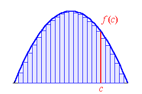

Finding the area under a curve means calculating the region between a given curve and the x-axis (the line y=0), within two limits, x=a and x=b. In mathematics, this is typically solved by integrating the function and evaluating the result at the specified limits. The difference gives the exact area under the curve. However, not all functions are integrable, and this method works best for smooth functions.

Numerical approximation provides a practical solution for estimating the area under curves, especially when analytical integration is not possible. The basic idea is to divide the interval [a, b] into n equal segments, each of width l = (b-a)/n. The area under each segment is approximated by a rectangle, where the width is the interval length and the height is the value of the function at either the start, end, or midpoint of the segment. The total area is then the sum of the areas of all rectangles.

The accuracy of this approximation improves as the interval width decreases. If the segments are made infinitesimally small, the approximation approaches the exact area. On a computer, we are limited by precision, but we can still achieve highly accurate results for practical purposes using these numerical methods.
